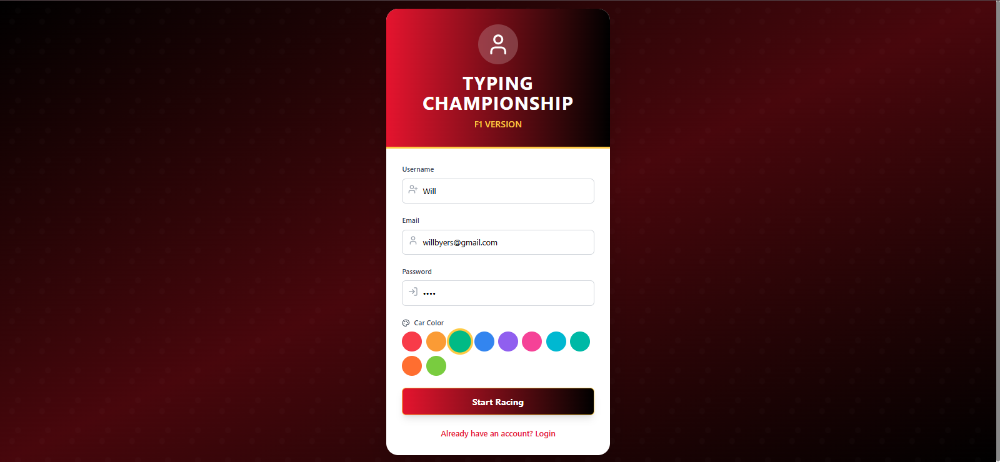
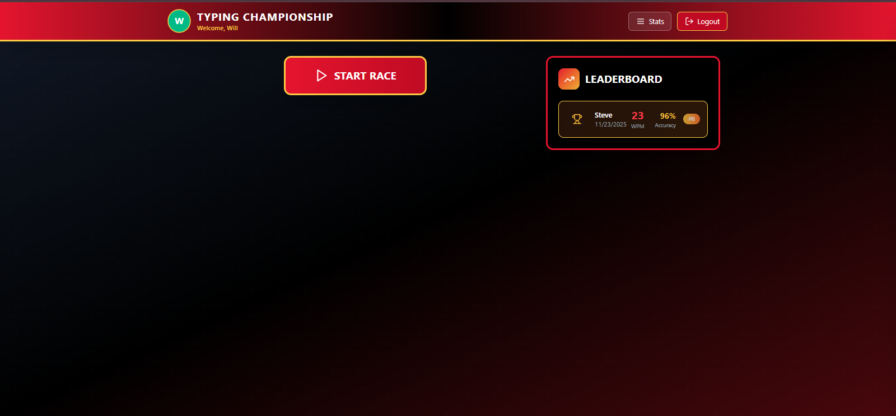
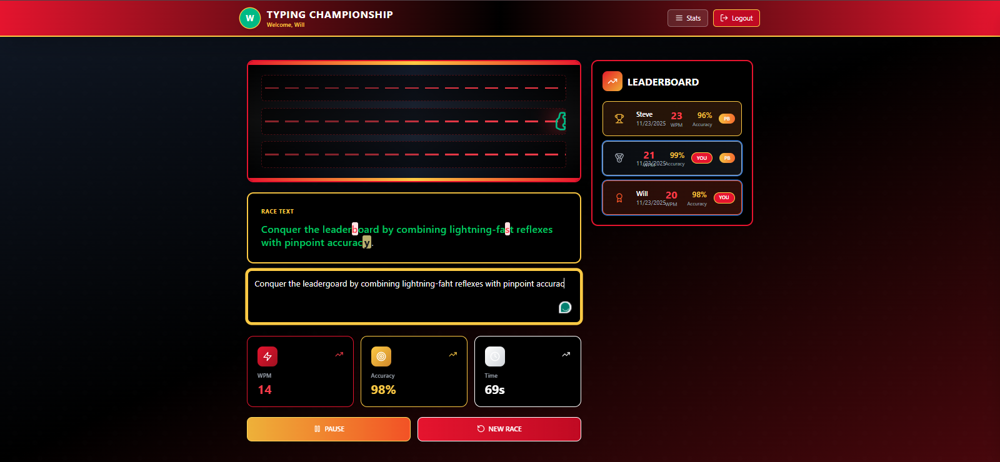
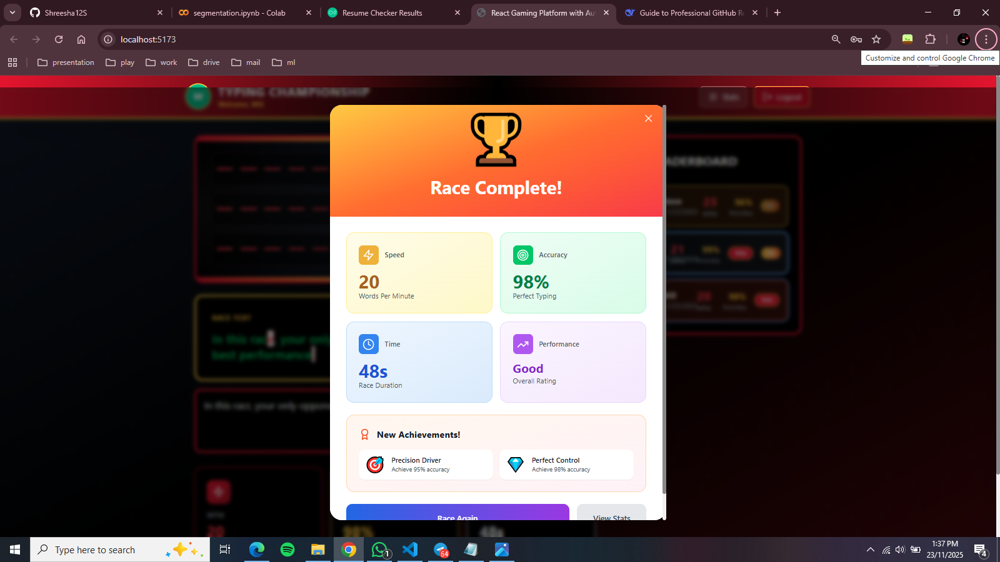

# 🏁 F1 Typing Championship

A high-performance, gamified typing test application built with React and TypeScript. Race against the clock, track your progress, and compete on the leaderboard.

## ✨ Features

- **🚀 Real-Time Racing Interface:** Dynamic typing test with live text rendering and instant visual feedback for errors
- **📊 Live Performance Analytics:** Immediate post-race results with **WPM** (Words Per Minute) and **Accuracy** calculations 
- **🏆 Persistent Leaderboards:** User rankings and race history stored locally using **Browser Local Storage**
- **🎮 Gamified Learning:** Achievement system and detailed post-race analytics to track improvement
- **👤 User Profiles:** Secure authentication to save personal stats and racing history

## 🛠️ Tech Stack

- **Frontend:** React, TypeScript
- **Build Tool:** Vite
- **Data Persistence:** Browser Local Storage API
- **Styling:** Tailwind CSS

## 🚀 Getting Started

### Prerequisites
- Node.js (v18 or higher)
- npm or yarn

### Installation

1. **Clone the repository**
   ```bash
   git clone https://github.com/Shreesha12S/f1-typing-championship.git
   cd f1-typing-championship
   ```

2. **Install dependencies**
   ```bash
   npm install
   ```

3. **Run the application**
   ```bash
   npm run dev
   ```

4. **Open your browser**
   - Navigate to `http://localhost:5173`
   - Start racing!

## 📁 Project Structure

```
f1-typing-championship/
├── src/
│   ├── components/              # React Components
│   │   ├── AchievementPopup.tsx # Achievement notifications
│   │   ├── AuthForm.tsx         # Login/Registration
│   │   ├── GameEngine.tsx       # Core game logic
│   │   ├── GameStats.tsx        # Live statistics display
│   │   ├── Leaderboard.tsx      # Rankings table
│   │   ├── RaceTrack.tsx        # Racing interface
│   │   ├── ResultsModal.tsx     # Post-race results
│   │   ├── Sidebar.tsx          # Navigation sidebar
│   │   ├── TypingArea.tsx       # Main typing input
│   │   └── UserProfile.tsx      # User profile management
│   ├── types/
│   │   └── game.ts              # TypeScript type definitions
│   ├── utils/                   # Utility Functions
│   │   ├── achievements.ts      # Achievement system logic
│   │   ├── gameTexts.ts         # Racing text content
│   │   └── storage.ts           # Local storage management
│   ├── App.tsx                  # Main application component
│   ├── main.tsx                 # Application entry point
│   └── index.css                # Global styles
├── public/                      # Static assets
├── screenshots/                 # Project screenshots
└── configuration files          # Vite, TS, Tailwind configs
```

## 🔧 Core Components

- **`GameEngine.tsx`** - Central game logic and state management
- **`TypingArea.tsx`** - Real-time typing interface with error highlighting
- **`RaceTrack.tsx`** - Visual racing progress indicator
- **`storage.ts`** - Local storage utilities for data persistence
- **`achievements.ts`** - Achievement system and progression tracking

## 📸 Screenshots







## 🔮 Future Enhancements

- [ ] Multiplayer real-time typing races
- [ ] Cloud synchronization for data backup
- [ ] Social features (friend lists, challenges)

## 👨‍💻 Author

**Shreesha S**
- LinkedIn: [Shreesha S](https://www.linkedin.com/in/shreesha-s-333733264)
- Email: shreesha12022005@gmail.com